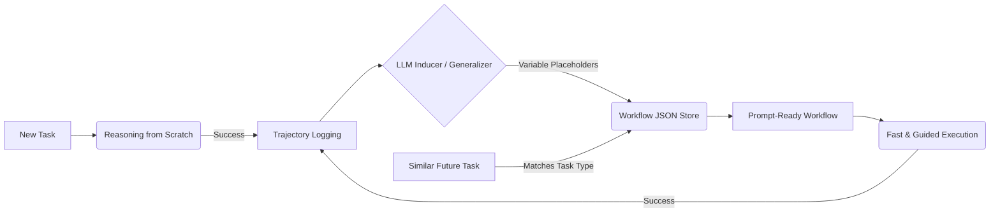
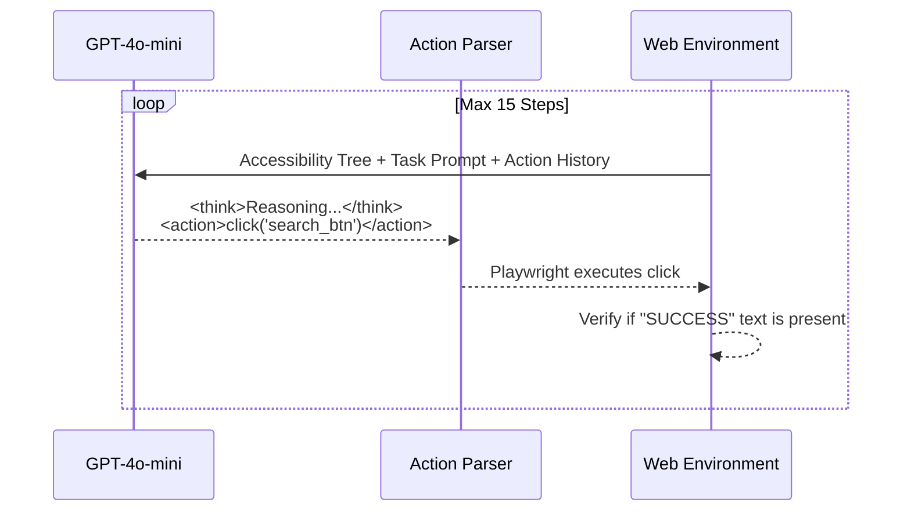

# Workflow Memory for Tool-Using Web Agents
**Midterm Progress Presentation**

---

## 1. Title Slide

- **Title:** Workflow Memory for Tool-Using Web Agents
- **Subtitle:** Enhancing Web Navigation Agents with Reusable Action Sequences
- **Visual Description:** 
  A simple web page split into two frames. On the left, a traditional agent struggling with step-by-step reasoning for a common task. On the right, a "Workflow Memory Agent" zipping through the task with an induced stored routine.
- **Key Message:** Traditional AI web agents reason from scratch every single time. Our project enables agents to remember, extract, and reuse successful workflows.

---

## 2. The Problem We Are Solving

- **Visual Concept:** *The Task Amnesia Problem*
- **Bullet Points:**
  - AI agents (like GPT-4 Vision / Playwright) treat every web task as entirely new.
  - This "reasoning from scratch" is:
    - **Slow:** High latency from repeatedly processing DOM accessibility trees.
    - **Expensive:** Consumes maximum API tokens even for trivial, repetitive flows.
    - **Error-Prone:** More steps mean a higher probability of hallucination or clicking the wrong element.
- **The Question:** If an agent successfully books a flight today, why must it figure out the *entire website layout again* tomorrow?

---

## 3. Our Solution: Agent Workflow Memory (AWM)

- **Visual Concept:** *The "Muscle Memory" Loop*
- **Bullet Points:**
  - **Execute & Observe:** The agent completes a novel task step-by-step.
  - **Extract:** We parse the successful trajectory and induce a generalized, reusable workflow subroutine.
  - **Inject:** For similar future tasks, the applicable workflow is fetched and structurally injected into the agent's context.



---

## 4. Phase 1: The Simulated Web Environment & Agent Loop

- **Visual Concept:** *The Playwright Pipeline*
- **Bullet Points:**
  - We built a local FastAPI web environment serving 3 task domains:
    - ✈️ **Flight Search** | 🛒 **Product Search** | 🍽️ **Restaurant Reservations**
  - **Agent Architecture:** Playwright Chromium automation + GPT-4o-mini async processing.
  - **Custom HTML Accessibility Parser:** Converts the DOM into a concise, interactive text tree for the LLM.



---

## 5. Phase 2: Workflow Induction (Making Memories)

- **Visual Concept:** *Generalizing the Abstract from Specifics*
- **Bullet Points:**
  - Specific values are abstracted into variable placeholders.
  - E.g., The string `"Boston"` becomes `{origin_city}`.
  - LLM evaluates the raw `<think>/<action>` trajectory and synthesizes structured JSON workflow steps.

*Example Output from our `memory/inducer.py`:*
```json
{
  "description": "Search for a one-way flight from an origin to a destination",
  "steps": [
    {
      "observation": "Flight search page loaded",
      "reasoning": "Specify the trip type to begin search",
      "action": "select('trip_type', 'one-way')"
    },
    {
      "observation": "Origin input field visible",
      "reasoning": "Enter the departure city",
      "action": "type('origin', '{origin_city}')"
    }
  ]
}
```

---

## 6. Phase 3: The Experiment Pipeline

- **Visual Concept:** *A/B Testing the Agent*
- **Bullet Points:**
  - **Baseline (No Memory):** Agent attempts 9 different task configurations entirely from scratch (3 per domain).
  - **With Workflow Memory:** Agent induces 1 workflow per domain, stores it, and reattempts the configurations dynamically referencing the stored procedure.
  - **Evaluation Metrics:**
    - Success Rate (%)
    - Average Steps Taken
    - Execution Time (Seconds)

---

## 7. Midterm Evaluation Results!

- **Visual Concept:** *Performance Comparison Table* (Use bold green text for improvements)
- **Key Findings:**
  - **Success Rate Unchanged:** Maintained a perfect 100% success rate across domains in both conditions (proving AWM does not break navigation).
  - **Steps Stagnant/Decreased:** Maintained 7.3 steps on average. However, Product Search dropped from 6.3 to 6.0 steps by discovering a shortcut!
  - **Speed Boost:** Total execution time dropped by **32%**.

| Condition | Success Rate | Avg Steps | Avg Time |
| :--- | :---: | :---: | :---: |
| **No Memory (Baseline)** | 100.0% | 7.3 | 15.8s |
| **With Workflow Memory** | 100.0% | 7.3 | **10.7s** 🚀 |

---

## 8. Why We Surpassed Baseline: Deep Dive

- **Visual Concept:** *Workflow Optimization (Side-by-side trajectory snippet)*
- **Bullet Points:**
  - **How the agent "learned" a shortcut:**
    - In Baseline *Product Search*, the agent accidentally skipped the `apply_sort_btn` and just proceeded to checkout.
    - Our workflow inducer captured this 6-step shortcut.
    - During subsequent runs with memory, the agent blindly trusted and executed the shorter, verified workflow layout, reducing the execution time and steps dynamically across completely new parameter inputs (e.g. searching for "Running shoes").
  - Workflow memory directly limits the LLM's hallucination potential by giving it an exact, working blueprint. 

---

## 9. Demo Video: Agent Workflow Memory in Action

*(Click PLAY to watch the automated agent run)*
- **Visual Description:** Insert the `.mp4` or `.webp` file of the agent operating within the Playwright Chromium shell.
- **Talking Points during video:** 
  - Watch as the left terminal parses the DOM tree.
  - Watch the LLM evaluate the injected workflow payload.
  - The right window displays the agent interacting at human speed without needing to analyze HTML tags on subsequent runs.

---

## 10. Next Steps for Finals (Execution Guards)

- **Visual Concept:** *The Path Forward*
- **Bullet Points:**
  - Currently, workflows assume a static website DOM. If the site updates, the workflow breaks.
  - **Implementation Goal:** Add *Execution Guards* (from the "ReUseIt" paper concept).
  - **Execution Guards include:**
    - Real-time Condition Checks (e.g., *Is the cart button disabled?*)
    - Fallback Actions (e.g., *If product is out of stock, go back and select product 2*).
  - Transitioning from simple task-type matching to **Vector Embeddings** for fuzzy task retrieval.
